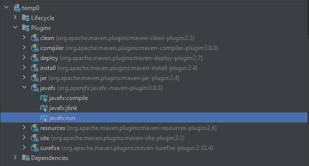
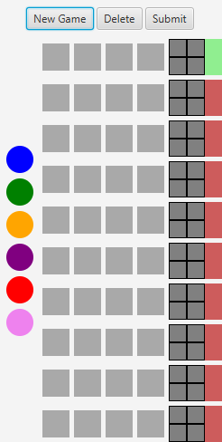
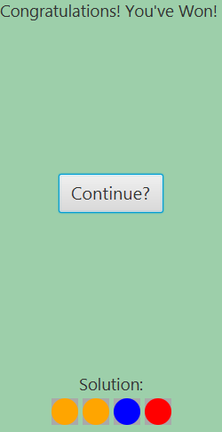

# JavaFX Mastermind Recreation

Hello! Welcome to my recreation of the popular 1970 board game "Mastermind"! In this game you take 
on the role of a code-breaker, trying to guess the randomly generated code in 10 guesses, getting feedback on
your previous guesses. I created this game as a way to practice my skills in creating GUIs through
javaFX 8, and as an exercise in following the Model-View-Controller design pattern. I hope you enjoy! 

## Dependencies
        <plugins>
            <plugin>
                <groupId>org.apache.maven.plugins</groupId>
                <artifactId>maven-compiler-plugin</artifactId>
                <version>3.8.0</version>
                <configuration>
                    <release>11</release>
                </configuration>
            </plugin>
            <plugin>
                <groupId>org.openjfx</groupId>
                <artifactId>javafx-maven-plugin</artifactId>
                <version>0.0.3</version>
                <configuration>
                    <mainClass>org.smelly.App</mainClass>
                    <launcher>launch</launcher>
                    <compress>2</compress>
                    <jlinkZipName>Mastermind-Game</jlinkZipName>
                    <jlinkImageName>Mastermind-Game</jlinkImageName>
                    <noManPages>true</noManPages>
                    <noHeaderFiles>true</noHeaderFiles>
                </configuration>
            </plugin>
        </plugins>
        
## Running the game
Assuming you have Maven and javaFX installed, you can run the game by executing javafx:run.

If you don't have these installed, here is a link to a download for a ZIP file which contains the game. Extract the ZIP to a location of your choosing and run the game
by entering the "bin" folder and running the batch file named "launch".
https://mega.nz/file/wJdSCbJT#oMtM-0ZyorUk2xinKbVJb3kfDOe4uV7apWivcTVANTY 
        
## How to play

You have 10 tries to guess the 4-color code constructed out of a pool of 8 different colors. 
Here is an image of what the game looks like.

The green light next to the 4x4 grid indicates which guess you are on. Click on 4 colors (there can be repeats)
and hit submit to see if you were right.

### Clues

There are two kinds of clue in Mastermind. A black circle and a white circle.

A black circle indicates that you have one color in the correct position. You will never see 4 black circles,
because that would mean that you won!

A white circle means you have on color that is present in the final code, but it's in the incorrect position.

### Winning and losing
If you use up all 10 of your guesses without guessing the code, you lose! No need to fret though, you can restart
as many times as you'd like :) If you manage to guess the code in under 10 tries, you are rewarded with the coveted 
victory screen!

### Quality of life

To help you on your Mastermind journey, there is a "New Game" button which simply resets your progress and generates
a new code to crack, and a "Delete" button which will backspace your previous color selection (as long as it hasn't been submitted yet). 

## Have fun! Thanks for checking out my project.
